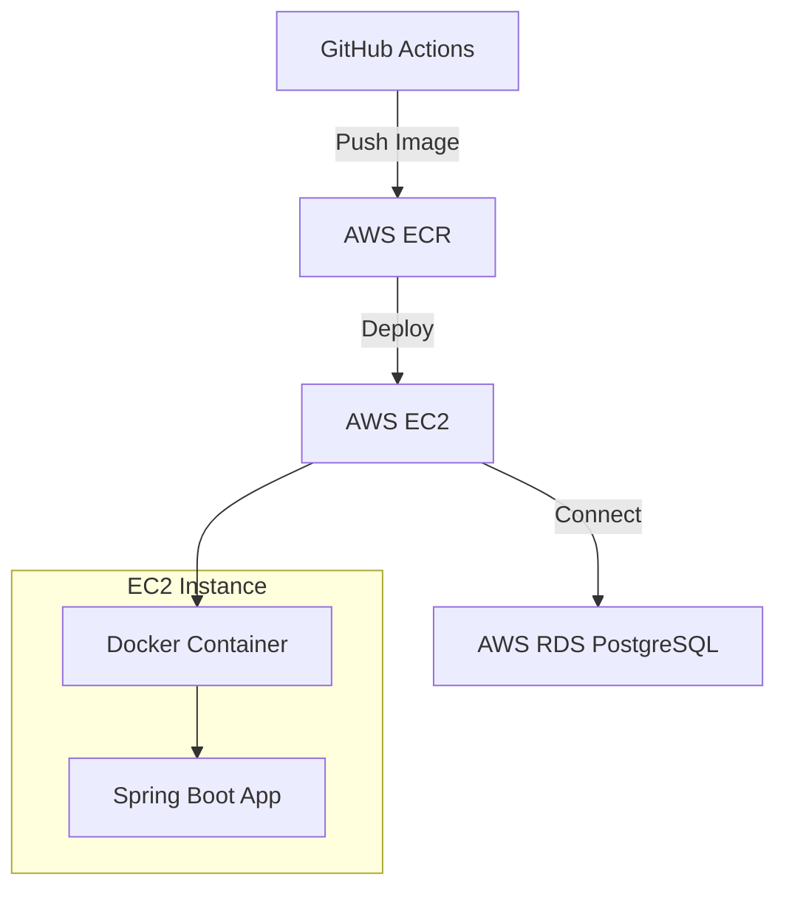

# 🏥 Caring Backend

> **케어링 플랫폼 백엔드 서비스** - 현대적이고 확장 가능한 케어 서비스 플랫폼

[](https://spring.io/projects/spring-boot)
[](https://openjdk.java.net/)
[](https://www.postgresql.org/)
[](https://www.docker.com/)
[](https://aws.amazon.com/)

## 📋 목차

1. [🏗️ 프로젝트 개요](#️-프로젝트-개요)
2. [🌐 인프라 및 배포](#-인프라-및-배포)
3. [🔀 브랜치 전략](#-브랜치-전략)
4. [📝 개발 규칙](#-개발-규칙)
5. [🏗️ 프로젝트 구조](#️-프로젝트-구조)
6. [⚙️ 환경설정](#️-환경설정)
7. [🚀 시작하기](#-시작하기)
8. [📚 API 문서](#-api-문서)

---

## 🏗️ 프로젝트 개요

### 🎯 주요 기능
- 👤 **사용자 관리**: 회원가입, 로그인, 프로필 관리
- 🏥 **기관 관리**: 케어 기관 등록 및 정보 관리
- 📋 **케어 서비스**: 케어 요청, 매칭, 관리 시스템
- 🔒 **인증/인가**: JWT 기반 보안 시스템
- 📊 **모니터링**: 시스템 상태 및 성능 모니터링

### 🛠️ 기술 스택
- **Language**: Java 17
- **Framework**: Spring Boot 3.5.5
- **Database**: PostgreSQL
- **ORM**: Spring Data JPA
- **Documentation**: Swagger/OpenAPI 3
- **Build**: Gradle
- **Containerization**: Docker
- **Cloud**: AWS (ECR, EC2, RDS)

---

## 🌐 인프라 및 배포

### ☁️ AWS 아키텍처



### 🚀 배포 프로세스

```
develop 브랜치 PR merge → main 브랜치 push → GitHub Actions → Docker Build → ECR Push → EC2 Deploy
```

#### 📋 배포 단계별 설명

1. **🔀 코드 병합**: `develop` → `main` 브랜치로 PR 승인 후 병합
2. **🤖 자동화**: GitHub Actions 워크플로 트리거
3. **🏗️ 빌드**: Docker 이미지 빌드 (멀티스테이지)
4. **📦 배포**: AWS ECR로 이미지 푸시
5. **🚀 실행**: EC2에서 새 컨테이너 배포

### 🗄️ 데이터베이스 구성

- **운영 DB**: AWS RDS PostgreSQL
- **개발 DB**: 로컬 PostgreSQL

---

## 🔀 브랜치 전략

### 🌳 브랜치 구조

```
main (운영)
├── develop (개발)
│   ├── feature/기능명-#이슈번호
│   ├── bugfix/버그명-#이슈번호
│   └── hotfix/긴급수정명-#이슈번호
└── release/버전명
```

### 📋 브랜치 생성 워크플로우

#### 1️⃣ 이슈 생성
먼저 GitHub에서 이슈를 생성합니다.

**예시:**
```
제목: [FEAT] ERD 기반 엔티티 코드화
내용: User, Institution, Care 엔티티를 ERD 기반으로 구현
라벨: 🚀 enhancement
```

#### 2️⃣ 이슈 번호 확인
생성된 이슈의 번호를 확인합니다. (예: `#6`)

#### 3️⃣ 브랜치 생성
이슈 번호를 포함한 브랜치를 생성합니다.

```bash
# 이슈 #6에 대한 브랜치 생성
git checkout develop
git pull origin develop
git checkout -b feature/ERD-기반-엔티티-코드화-#6
```

### 📋 브랜치 네이밍 규칙

| 브랜치 타입 | 네이밍 형식 | 예시                           |
|------------|-------------|------------------------------|
| 기능 개발 | `feature/기능명-#이슈번호` | `feature/erd-기발-엔티티-코드화-#12` |
| 버그 수정 | `bugfix/버그명-#이슈번호` | `bugfix/로그인-인증-버그수정-#24`     |
| 긴급 수정 | `hotfix/수정명-#이슈번호` | `hotfix/security-patch-#35`  |
| 릴리즈 | `release/버전` | `release/v1.0.0`             |

---

## 📝 개발 규칙

### 📖 주석 작성 규칙

#### JavaDoc 적극 활용
```java
/**
 * 👤 사용자 서비스
 *
 * 사용자 관련 비즈니스 로직을 처리합니다.
 *
 * @author caring-team
 * @since 1.0.0
 */
@Service
public class UserService {

    /**
     * 🔍 사용자 ID로 조회
     *
     * @param userId 사용자 ID
     * @return 사용자 정보
     * @throws UserNotFoundException 사용자를 찾을 수 없는 경우
     */
    public User findById(Long userId) {
        // 구현 내용
    }
}
```

### 🏗️ 계층 구조 및 폴더 구조

```
src/main/java/com/caring/caringbackend/
├── 📱 api/                    # API 계층
│   ├── controller/            # 컨트롤러
│   ├── dto/                   # 데이터 전송 객체
│   │   ├── request/          # 요청 DTO
│   │   └── response/         # 응답 DTO
│   └── mapper/               # 엔티티-DTO 매퍼
├── 🏢 domain/                # 도메인 계층
│   ├── member/                 # 사용자 도메인
│   │   ├── entity/          # 엔티티
│   │   ├── repository/      # 레포지토리
│   │   ├── service/         # 서비스
│   │   └── dto/             # 도메인 DTO
│   ├── institution/         # 기관 도메인
│   ├── care/                # 케어 도메인
│   └── notification/        # 알림 도메인
├── 🌐 global/               # 글로벌 설정
│   ├── config/              # 설정 클래스
│   │   ├── jpa/            # JPA 설정
│   │   ├── security/       # 보안 설정
│   │   ├── swagger/        # API 문서 설정
│   │   └── web/            # 웹 설정
│   ├── exception/          # 예외 처리
│   ├── model/              # 공통 모델
│   ├── response/           # 공통 응답
│   └── util/               # 유틸리티
└── 🧪 CaringBackendApplication.java
```

### 📋 이슈 및 브랜치 생성 규칙

#### 🎯 이슈 네이밍
```
[타입] 간단한 설명 (#이슈번호)

예시:
[FEAT] 사용자 로그인 기능 구현 (#123)
[BUG] 회원가입 시 이메일 중복 검증 오류 (#124)
[DOCS] API 문서 업데이트 (#125)
```

#### 🏷️ 이슈 라벨
- `🚀 enhancement`: 새로운 기능
- `🐛 bug`: 버그 수정
- `📚 documentation`: 문서 작업
- `🔧 maintenance`: 유지보수
- `🚨 critical`: 긴급 수정

#### 🔗 이슈-브랜치-PR 연결 워크플로우

##### 📌 전체 프로세스
```
1. 이슈 생성
   [FEAT] ERD 기반 엔티티 코드화 #6

2. 브랜치 생성
   git checkout develop
   git pull origin develop
   git checkout -b feature/ERD-기반-엔티티-코드화-#6

3. 작업 및 커밋
   git commit -m "feat: User 엔티티 구현 #6"
   git commit -m "feat: Institution 엔티티 구현 #6"

4. PR 생성
   제목: [FEAT] ERD 기반 엔티티 코드화 #6

5. 코드 리뷰 및 병합
```

### 💻 코드 컨벤션

#### 📝 네이밍 규칙
- **클래스**: PascalCase (`UserService`, `OrderController`)
- **메서드/변수**: camelCase (`findUser`, `userName`)
- **상수**: UPPER_SNAKE_CASE (`MAX_RETRY_COUNT`)
- **패키지**: lowercase (`com.caring.caringbackend.domain.member`)

#### 🔧 메서드 네이밍
```java
// ✅ 좋은 예
public User findUserById(Long id)
public void createUser(CreateUserRequest request)
public boolean isEmailDuplicated(String email)

// ❌ 나쁜 예
public User getUser(Long id)
public void makeUser(CreateUserRequest request)
public boolean checkEmail(String email)
```

### 🔄 PR 규칙 및 리뷰 규칙

#### 📋 PR 템플릿
```markdown
## 🎯 작업 내용
- [ ] 구현한 기능 1
- [ ] 구현한 기능 2

## 🧪 테스트
- [ ] 단위 테스트 작성
- [ ] 통합 테스트 확인

## 📸 스크린샷 (필요시)

## 📝 특이사항
```

#### ✅ PR 승인 기준
- **필수**: 최소 1명의 리뷰어 승인
- **권장**: 2명의 리뷰어 승인 (중요 기능)
- **빌드**: 빌드 성공 확인

---

## ⚙️ 환경설정

### 📄 프로필 관리

#### `application.yml` (공통 설정)
```yaml
spring:
  application:
    name: caring
  profiles:
    active: dev

springdoc:
  api-docs:
    path: /v3/api-docs
  swagger-ui:
    path: /swagger-ui.html
```

#### `application-dev.yml` (개발 환경)
```yaml
spring:
  datasource:
    url: ${DATASOURCE_URL}
    username: ${DATABASE_USERNAME}
    password:  ${DATABASE_PASSWORD}
  jpa:
    hibernate:
      ddl-auto: create-drop
    show-sql: true

logging:
  level:
    com.caring.caringbackend: DEBUG
```

#### `application-prod.yml` (운영 환경)
```yaml
spring:
  datasource:
    url: ${DATASOURCE_URL}
    username: ${DATASOURCE_USERNAME}
    password: ${DATASOURCE_PASSWORD}
  jpa:
    hibernate:
      ddl-auto: update
    show-sql: false

logging:
  level:
    com.caring.caringbackend: INFO
```

### 🔐 환경변수 관리

| 변수명                   | 설명 | 예시 |
|-----------------------|------|------|
| `DATASOURCE_URL`      | 데이터베이스 URL | `jdbc:postgresql://rds-endpoint:5432/caring` |
| `DATASOURCE_USERNAME` | DB 사용자명 | `caring_user` |
| `DATASOURCE_PASSWORD` | DB 비밀번호 | `secure_password` |
| `JWT_SECRET`          | JWT 서명 키 | `your-secret-key` |

---

## 🚀 시작하기

### 📋 사전 요구사항
- Java 17+
- Docker & Docker Compose
- PostgreSQL 13+

---

## 📚 API 문서

### 📖 Swagger UI
- **개발 환경**: http://localhost:8080/swagger-ui/index.html
- **운영 환경**: http://43.203.41.246:8080/swagger-ui/index.html

---

## 🤝 기여하기

1. 이슈 생성 및 할당
2. 브랜치 생성 (`feature/기능명`)
3. 코드 작성 및 테스트
4. PR 생성 (템플릿 활용)
5. 코드 리뷰 및 승인
6. 메인 브랜치 병합

---

## 📞 문의

- 🐛 **버그 리포트**: GitHub Issues
- 💡 **기능 제안**: GitHub Discussions
- 📧 **일반 문의**: caring-team@example.com

---

**Made with ❤️ by Caring Team**
